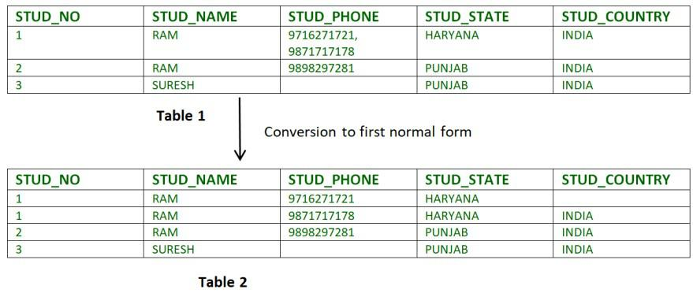
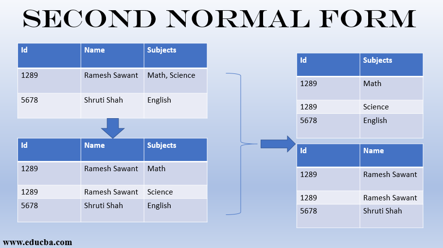
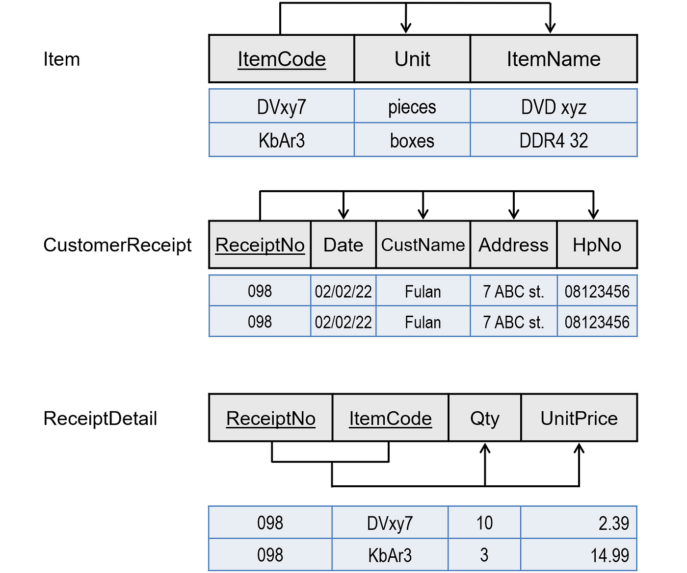
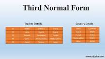

### Topic : First Normal From and Second Normal Form, BNCF, Third Normal From, Fourth Normal Form
---

First Normal Form and Second Normal Form:

The first normal form helps to eliminate duplicate data and simplify queries.

It also ensures A table is in first normal form (1NF) if and only if all columns contain only atomic values—that is, each column can have only one value for each row in the table.

One example would be an employee's name, which can be broken into first and last names

The Second normal form eliminates redundant data by requiring that each non-key attribute be dependent on the primary key. 

 if we take an example of about 100 candidates taking the S1 subject, then we don't have to store their fees as 1000 as a record for all the 100 candidates.This example is regarded on geeks for geeks.

 The second Normal Form applies to relations with composite keys, that is, relations with a primary key composed of two or more attributes

Boyce-Codd Normal Form (BCNF):

BNCF is an advanced version of the third normal form (3NF), and often, it is also known as the 3.5 Normal Form. 

A table is in BCNF when for all nontrivial FDs (X → A), X is a superkey for the whole schema. A superkey is a unique set of columns that identify each row in a table, but you can remove some columns from it and it will still be a key. Informally, a superkey is carrying extra weight.

It ensures that each determinant of a relation is a candidate key, which means that all non-trivial functional dependencies are eliminated.

Third Normal Form (3NF):

when it's in 2NF but has no transitive partial dependency. Meaning, when no transitive dependency exists for the attributes that are non-prime, then the relation can be said to be in 3NF

We use the 3NF to reduce any duplication of data and achieve data integrity in a database. The third normal form is fit for the designing of normal relational databases

The candidate key in the above table is ID. The functional dependency set can be defined as ID->NAME, ID->SUBJECT, ID->STATE, STATE->COUNTRY. If A->B and B->C are the two functional dependencies, then A->C is called the Transitive Dependency.

Fourth Normal Form (4NF):

Fourth Normal Form (4NF) is a database normalization technique used in the field of relational database management systems (RDBMS) to reduce data redundancy and improve data integrity.

4NF is used to refine database design and eliminate anomalies related to multi-valued dependencies. It ensures that each attribute in a relation is fully dependent on the primary key, simplifying data management and improving data integrity.

In class we discussed about the topics in groups with respectred topics to assigned groups and hence we disscussed and explained within our group and after time was up we then went to other groups which had differnt topics disccusing it altogether and learning the above normal forms.

i would like madam to slow down on teaching us new topics as susch as pg admin for its new to us and learing it in one day doesnt make sense and right now we are getting hard time to learn everything for pg admin is just new to us and getting a practical assignments is hard i would like madam to demonstrate it agian in class for the exercise type as my data is having hard time loading and if madam could demonstrate it would helpful for us students in new types of apps.