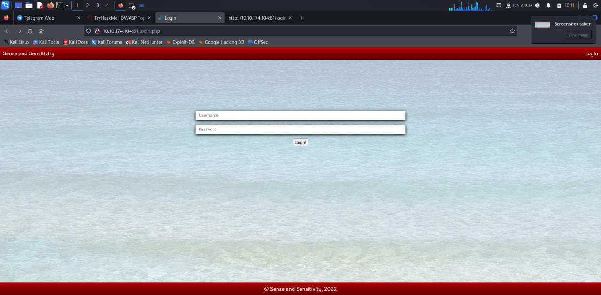
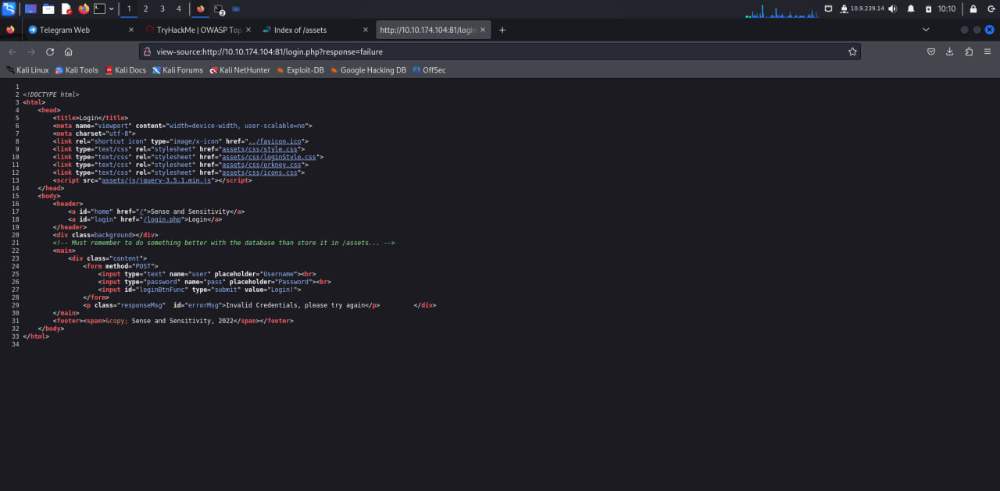
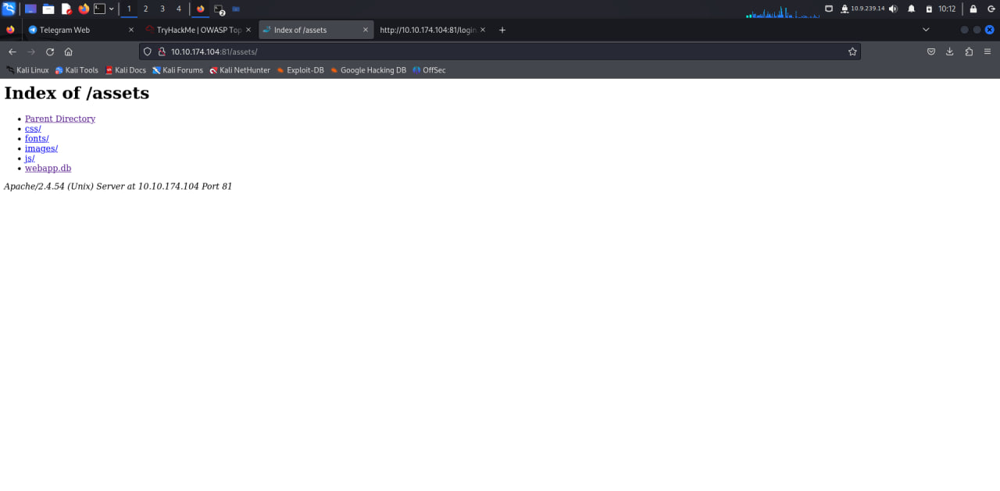

### Topic : OWSAP Top10 2021

## Broken access control

Broken access control vulnerability is a security flaw that allows unauthorized users to access, modify, or delete data they shouldn't have access to. This vulnerability is considered one of the most critical web application security risks.

Authentication is “broken” when attackers are able to compromise passwords, keys or session tokens, user account information, and other details to assume user identities. Due to poor design and implementation of identity and access controls, the prevalence of broken authentication is widespread.

As we can see go into the website we can login with username ="noot" and password = "test1234" we already have the username and the password we have to find the flag and to find the flag we see that this is Broken access control vulnerability as the image shows that (id=1) we can change the id until we find root flag and as we put (id=5) the website gives us that it can be lower than 1 so we can put (id=0) which gives us the root flag.

The problem arised as to the URL was vulnerable so we must always verify user inputs such as data from HTML forms and URL query parameters so that it prevents from the attack.

## Cryptographic Failures

 Cryptographic failures are where attackers often target sensitive data, such as passwords, credit card numbers, and personal information, when you do not properly protect them.

 The impact of such failures can be profound, resulting in compromised data integrity, breached confidentiality, and erosion of trust in digital systems.

 

 As we can see we dont have any information for password and username so first we go to inspect from source .

 

 After using inspect from source we see that the green line shining is telling that the database is stored in assets so we see that this is cryptographic failure as the green line is a comment and was not hidden .

 

 As we use word asssets in the http we see there are list and out of many of them webapp.db is the most dangerous for the attackers to attack as it is a database which contains data and it can be private.

 

 So we download the webapp.db and we open it in our terminal using the code "sqlite3 webapp.db" which create a database, define tables, insert and change rows, run queries and manage an SQLite database file and after that it is just using sql codes to see the data and we can see from the code "SELECT * FROM users;" which will show the daat for users and we see admin with password which is encrypted in hash.

 

 TO get the password we have to crack the hash and it can cracked from hash cracker website above and we get the password.

 To prevent this cryptographic failures we must Identify which data is sensitive according to regulatory requirements, or business needs.
Don't store sensitive data unnecessarily.
Make sure to encrypt all sensitive data at rest.
Disable caching for responses that contain sensitive data.

## INJECTION

The following are some examples of distinct kinds of injection attacks
SQL Injection (SQLi) ,
Cross Site Scripting Attacks (XSS) ,
OS Command Injection Attack ,
Code Injection Attacks ,
Server-Side Template Injection (SSTI) Attack ,
HTTP Header Injection,
LDAP Injection Attack.

SQL injection vulnerabilities most commonly occur when the Web application developer does not ensure that values received from a Web form, cookie, input parameter, and so forth are validated or encoded before passing them to SQL queries that will be executed on a database server.

Injection vulnerabilities allow attackers to insert malicious inputs into an application or relay malicious code through an application to another system.

We can run code in Cosway Online by using "$"$ and as we get in the website we want to see the list so we use the code " $(ls)" which gives us the list of two file in the image.

To see the logins we use the above code which cat the etc and password.

After getting the logins we can see that there is no login so the login inside is zero as we see one by one.

we see the user is running in apache app in the the above picture.

To see the app version we run the above code which makes us see the version release by cat function.

A common first step to preventing SQL injection attacks is validating user inputs using whitelisting or allow lists. A developer will identify the essential SQL statements and establish a whitelist for all valid SQL statements, leaving unvalidated statements out of the query.

## Insecure Design

Insecure design is a type of flaw that can sit in the background of everything you do. This vulnerability relates to how you as a developer design your programs, architect solutions, and employ security practices such as threat modeling — meaning that insecure design can present itself in a wide variety of ways.

One common example of insecure design is failing to properly authenticate users before granting them access to sensitive data or functionality. Another example is not properly validating user input, which can allow attackers to inject malicious code into an application.

As i go to the URL we know the username but we dont know the password but we use forget password and there is 3 options and form the 3 options there is "what is your favourite colour" and we try all the color combinations and after all the combinations we get in using the color green which shows that this a insecure design that can be easily attacked if the attackers has username.

after using th green color we get the password which is a high vunleribility.

After entering the password and username we can login inside and see private file of users and we can also ge the flag file .

Insecure design vulnerabilities can be avoided altogether by including diligently planned threat modeling, proactive vulnerability management, tried-and-true architectural patterns, and proper SDLC. Carrying out security testing can significantly increase the application's inherent security.

## Security Misconfiguration

A security misconfiguration occurs when system or application configuration settings are missing or are erroneously implemented, allowing unauthorized access. Common security misconfigurations can occur as a result of leaving default settings unchanged, erroneous configuration changes or other technical issues.

Examples of security misconfigurations include: Failure to disable debugging features in release builds, which can expose sensitive information. Allowing insecure communication protocols, such as HTTP, instead of enforcing secure communication over HTTPS.

we can see that the console for the website lets us code and heche we can find list file with the above command and we get the list which should be private like todo.db which is a data base.

To find the flag it is in app.py so we just need to use code "cat app.py" which easily gives us the secret flag as this above this is security misconfiguration.

Some other ways to avoid security misconfiguration errors are:

Regularly monitor web application security and vulnerabilities,
Define and monitor non-default security settings for apps and programs,
Remove unused applications, programs, and features.

## Vulnerable and Outdated Components

A vulnerable and outdated component is a software component that is no longer being supported by the developer, making it susceptible to security vulnerabilities.

Vulnerable and outdated components refer to when open-source or proprietary code contains software vulnerabilities or is no longer maintained. This code can be in the form of libraries or frameworks, and for web applications this can include Laravel (PHP), Angular (JavaScript), Django (Python) and many others.

Vulnerable components contain security flaws that attackers can exploit to gain unauthorized access to sensitive data or take control of the system. These vulnerabilities can exist for years before they are discovered and patched. Outdated components are no longer supported by their developers.

In this topic we will mainly use exploit database which exploits database

we know out website is bookstore 1.0 which can be found in exploit DB so it can be easily exploit.

we found the exploit for the bookstore db so we download it.

we open our exploit file which is python byt the above code giving the website http so that can it is exploited and we can enter inside.

After entering inside we use the code ls to to show the list and we kknow the flag is in the file flag.txt so we use the code  $cat /opt/flag.txt$ which gives us the flag.

To prevent this Remove unused dependencies, unnecessary features, components, files, and documentation.
Continuously inventory the versions of both client-side and server-side components (e.g., frameworks, libraries) and their dependencies using tools like versions, OWASP Dependency Check, retire.

## Identification and Authentication Failures

Identification and authentication failures are security vulnerabilities that can occur when a system or application fails to identify or authenticate a user correctly. This can allow attackers to gain unauthorized access to systems and data.

a user entering the incorrect password at the suggestive prompt but is able to login to the website is an example of authentication failure. In this instance, the application failed to accurately validate the identity of the user, allowing the mistaken identity to login.

we know that username darren already exist but we need to login as darren to get the flag and the way to login as darren is give a space in the first letter of darren which makes us login as darren.

we get regestired succesfully and after that we login.

after login we get the flag. This shows that this is identification authentication which is a high vulnerbility for attacker to attack.

to login as aurthur it is same like we did in darren as to give space.

after registration and login we get the flag.

To prevent this Using a password manager can help you generate strong, unique passwords for all your accounts and prevent you from reusing passwords. This reduces the risk of a data breach affecting multiple accounts, as well as the risk of brute force attacks.

## Software and Data Integrity Failures

Software and data integrity failures are vulnerabilities in software or infrastructure that allow an attacker to modify or delete data in an unauthorized manner. Attackers can exploit these vulnerabilities to gain access to sensitive information or cause damage to the system.

Malware, hacking and other cyber threats can steal, alter or destroy valuable data. This can result in a loss of both data integrity and data security.

we have to get the SHA-256 hash and to get this we can go to SRI hash generator website.

We can just copy paste the url and it will hash it.

To prevent this  Use digital signatures or similar mechanisms to verify the software or data is from the expected source and has not been altered. Ensure libraries and dependencies, such as npm or Maven, are consuming trusted repositories.

## Data Integrity Failures

 Software and data integrity failures are vulnerabilities in software or infrastructure that allow an attacker to modify or delete data in an unauthorized manner. Attackers can exploit these vulnerabilities to gain access to sensitive information or cause damage to the system.

 Malware, hacking and other cyber threats can steal, alter or destroy valuable data. This can result in a loss of both data integrity and data security.

 Data integrity may be compromised through: Human error, whether malicious or unintentional. Transfer errors, including unintended alterations or data compromise during transfer from one device to another.
 
 

the above picture is showing us the encoding and decoding which has different header and playload and signature.

 

 To encode and decode we must use the base 64 encoder and decoder website .

 

 i encoded the cookies and stored them in the word document as decoded i changed it to admin and none so that i can get in as admin.

 

 i got the cookies from the picture as i insepect and went to change the and put my encoded code in the replace to enter in it as admin.

 

 After changing the cookies http to admin and realoading the page i got the flag.

 Ways to Reduce Data Integrity Risk:
Ensure all computer systems are 21 CFR Part 11 compliant. ...
Follow a software development lifecycle. ...
Validate your computer systems. ...
Implement audit trails. ...
Implement error detection software. ...

## Security Logging & Monitoring Failures

Security logging and monitoring failures are security vulnerabilities that can occur when a system or application fails to log or monitor security events properly. This can allow attackers to gain unauthorized access to systems and data without detection.

Security event logging and monitoring is a process that organizations perform by examining electronic audit logs for indications that unauthorized security-related activities have been attempted or performed on a system or application that processes, transmits or stores confidential information.

Insufficient logging and monitoring is the most common reason why businesses fail to deal with a security breach effectively. Organisations must be equipped by logging the entire activity, or it could be difficult for the organisation to find the attacker.

We downloaded the file and it shows the ways how the attacker attacked in an unthorized way.

we can see the attacker was using brute force to attack into the system as he first started as admin to admistrator to anonymous to root as he went step by step.

we can also see the attacker ip address which makes the attacker caught.

To prevent this we must do insufficient logging and monitoring of systems can impact visibility, incident alerting, login failures, system failures and breaches. This makes it essential to have a fully operational logging and monitoring system to collect logs and give out alerts to Security Operation Center (SOC) staff and administrators.

## Server-Side Request Forgery (SSRF)

Server-side request forgery is a web security vulnerability that allows an attacker to cause the server-side application to make requests to an unintended location.

 Server-Side Request Forgery (SSRF) can be used to make requests to other internal resources which the web server has access to, but are not publicly facing. Such an example would be accessing instance metadata in Amazon EC2 and OpenStack instances.
 